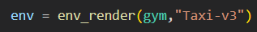
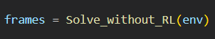

## Table of contents
* [Overview](#overview)
* [Methods](#methods)
* [Technologies](#technologies)
* [Setup](#setup)
  
## Overview
This project is an application on reinforcement learning and Q-learning using OpenAI enivroment (gym).

The code is generalized that it can work on any other eniveroment.

  
## Methods
In this project, you can train the agent using 2 methods:

1.  Without Q-learning: 

you need to send the enviroment that was initialized in the env_render function as a parameter.

 

2.  Q-learning: 

you need to send the enviroment that was initialized in the env_render function as a parameter. You need also to provide alpha, gamma,epsilon and episodes respectively.

It return Q-table values wich is 2D numpy array (500,6)

2.1) Testing: 

It test the learning process of the agent using the Q-table values.

 

  

## Technologies
Project is created with:
* Python: 3.8.8
* numpy: 1.20.1
* gym: 0.24.0
* Ipython

  

## Setup
To run this project, install all the written dependencies. Make sure that they are all installed in you kernel.

    

# !! This code take a long time to run because of the GridSearch function, as it train and test for all possible permutaions of alpha, gamma and epsilon !!.

## you can either narrow the steps, or to edit GridSearch function to iterate on n elements only in the tuple.

